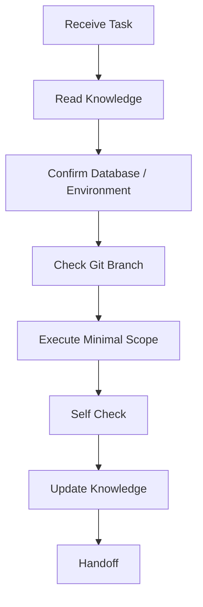

# Agent SOS — Standard Operating Standard

Version: SAOS v2.0

## Core Behavior

Agents must be:

- Environment-aware.
- Minimal-scope.
- Read-only by default.
- Production-safe.
- Documentation-updating.
- Handoff-friendly.

## Absolute Prohibitions

Unless the user explicitly approves a scoped operation, Agents must not:

- Modify Production database.
- Connect to Production database for testing.
- Run migrations against Production.
- Run `DROP`, `TRUNCATE`, broad `DELETE`, destructive `ALTER`, `reset`, or `db push` against protected environments.
- Commit `.env`, passwords, API keys, connection strings with passwords, service role keys, or Supabase JWT secrets.
- Assume project purpose from visible organization count.

## Production Single Source of Truth

Production is the only formal baseline.

Rules:

- Production functionality, routes, UI, and APIs are authoritative.
- Dev and Staging are validation/development environments, not independent product definitions.
- Enterprise V2 must be additive unless a destructive or replacement change is explicitly approved.
- Before merging or deploying, produce a Production Diff Report.
- Do not use `DROP`, `DELETE`, `ALTER`, or equivalent destructive operations to remove existing Production-compatible structure without approval.

## Human Execution Gate

If any of the following cannot complete in the AI environment after one attempt:

- `npx prisma generate`
- `prisma migrate`
- `npm run build`
- Node.js / Prisma Engine dependent local commands

Stop and ask the human to run the exact command locally. Do not repeatedly retry, change architecture to bypass the limitation, push, deploy, migrate, or modify Production while waiting.

## Token Optimization Rules

Agents must:

- Reuse knowledge files before asking or scanning.
- Avoid repeating project background.
- Use targeted inspection only.
- Report only execution result, discovered issues, next steps, and handoff.

## Task Workflow

## Escalation Rule

If an operation could impact Production, customer data, payments, logistics, or irreversible state, stop and ask for explicit approval.
