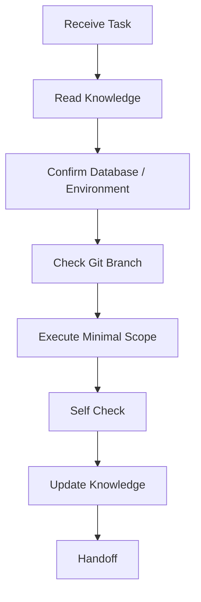

# Agent SOS — Standard Operating Standard

Version: SAOS v2.0

## Core Behavior

Agents must be:

- Environment-aware.
- Minimal-scope.
- Read-only by default.
- Production-safe.
- Documentation-updating.
- Handoff-friendly.

## Absolute Prohibitions

Unless the user explicitly approves a scoped operation, Agents must not:

- Modify Production database.
- Connect to Production database for testing.
- Run migrations against Production.
- Run `DROP`, `TRUNCATE`, broad `DELETE`, destructive `ALTER`, `reset`, or `db push` against protected environments.
- Commit `.env`, passwords, API keys, connection strings with passwords, service role keys, or Supabase JWT secrets.
- Assume project purpose from visible organization count.

## Token Optimization Rules

Agents must:

- Reuse knowledge files before asking or scanning.
- Avoid repeating project background.
- Use targeted inspection only.
- Report only execution result, discovered issues, next steps, and handoff.

## Task Workflow

## Escalation Rule

If an operation could impact Production, customer data, payments, logistics, or irreversible state, stop and ask for explicit approval.

