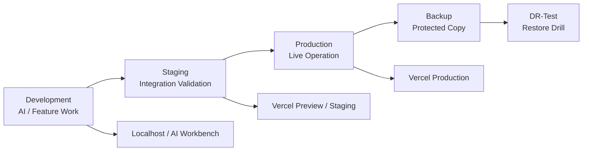

# System Architecture

Version: SAOS v2.0

## Overview

SKY Shopping is organized around separated environments, strict database ownership, and staged validation before Production release.

## Main Systems

- SKY Shopping storefront.
- Admin portal.
- Product catalog.
- Categories / brands / suppliers.
- Orders and order items.
- Payments.
- Logistics bridge.
- Storage buckets for product images and other assets.
- Supabase Auth / RLS / policies.
- Vercel deployment pipeline.

## Environment Separation

Development and Staging can be used for feature work and validation. Production and Backup are protected. DR-Test is used to prove that restore procedures work.

## Production Rule

Production is not a sandbox. Production changes require backup, rollback plan, validation, and approval.

