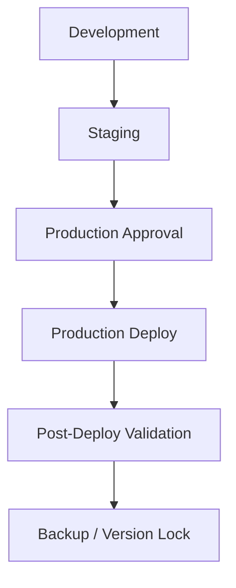

# Deployment Rules

Version: SAOS v2.0

## Promotion Flow

## Development

Allowed:

- Feature development.
- Local validation.
- Test data creation.
- Schema experiments only if scoped and approved.

## Staging

Allowed:

- Integration validation.
- Preview deployment.
- Production-parity UI/API/schema validation.

Not required:

- Identical row data with Production.

## Production

Production is the single source of truth for functionality, routes, UI, and APIs.

Before any work starts, every Agent must produce:

1. Production Commit
2. Working Branch Commit
3. Diff Summary
4. Additive: Yes / No
5. Production Impact: Yes / No

Required before deploy:

- Production DB backup confirmed.
- Rollback tag created.
- Dev validation passed.
- Staging validation passed.
- Production Diff Report completed.
- Mobile and desktop validation.
- Login, product page, cart, checkout, order, order items, logistics bridge validation.
- Production approval.

## Rollback

Rollback must identify:

- Git tag / commit to revert to.
- Vercel deployment to restore.
- Database impact.
- Whether DB rollback is required.
- Estimated RTO / RPO.

## Forbidden

- Production `db push`.
- Production migration without explicit approved migration plan.
- Secret changes without documented owner approval.
- Dev / Staging-only feature removals that make them diverge from Production baseline.
- Destructive `DROP`, `DELETE`, or `ALTER` to existing Production-compatible structure without approval.
- Starting Enterprise V2 from an old branch.
- Using old Development state to overwrite Production.
- Rebuilding Production-existing functionality because it is missing in Dev/Staging.
- Modifying UI/API/Schema without Production comparison.

## Human Execution Gate

If `npx prisma generate`, `prisma migrate`, `npm run build`, or a Node.js / Prisma Engine command fails due the AI sandbox, retry at most once. If still blocked, stop and request human execution. Do not push, deploy, migrate, or modify Production while waiting.

## Recovery-First Deployment Strategy

Do not prioritize DB Push.

Before major development or integration:

1. Production → Backup automatic sync must be designed and verified.
2. Backup → DR-Test Restore Drill must pass.
3. One-click recovery must be validated.
4. Logistics integration and Enterprise V2 can proceed only after recovery foundation is stable.

## Current Environment Roles

商城：

| Role | Project Ref | Rule |
| --- | --- | --- |
| Production | `yafykwpivreqexbcilfm` | Official baseline; no AI modification. |
| Backup | `iynhnfquzvzkvyvaitoh` | Formal backup; sync only. |
| Development | `rvrdlofcaerzxktqpbjk` | Development and schema verification only. |

物流：

| Role | Project Ref | Rule |
| --- | --- | --- |
| Production-like | `kyzwwotjunouzegyfqgz` | Read-only; not Restore Drill. |
| Backup | `vwarhnoewfjugwkrmpkm` | Logistics backup. |

DR-Test:

- Must be a new blank project.
- Must not reuse Production, Backup, Development, or Logistics Production-like projects.
