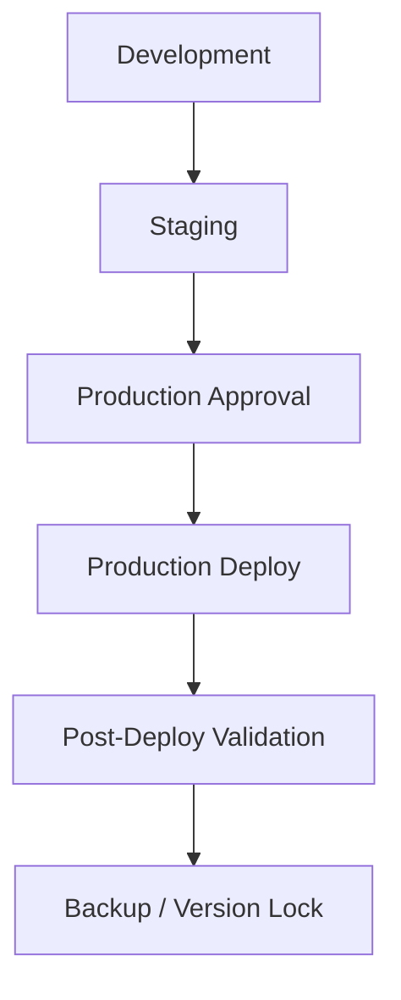

# Deployment Rules

Version: SAOS v2.0

## Promotion Flow

## Development

Allowed:

- Feature development.
- Local validation.
- Test data creation.
- Schema experiments only if scoped and approved.

## Staging

Allowed:

- Integration validation.
- Preview deployment.
- Production-parity UI/API/schema validation.

Not required:

- Identical row data with Production.

## Production

Required before deploy:

- Production DB backup confirmed.
- Rollback tag created.
- Dev validation passed.
- Staging validation passed.
- Mobile and desktop validation.
- Login, product page, cart, checkout, order, order items, logistics bridge validation.
- Production approval.

## Rollback

Rollback must identify:

- Git tag / commit to revert to.
- Vercel deployment to restore.
- Database impact.
- Whether DB rollback is required.
- Estimated RTO / RPO.

## Forbidden

- Production `db push`.
- Production migration without explicit approved migration plan.
- Secret changes without documented owner approval.

