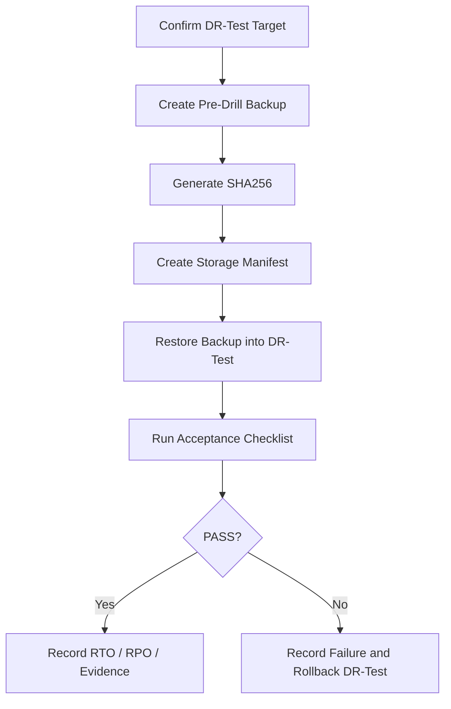

# DR Restore Playbook

Version: SAOS v2.0

## Purpose

DR-Test verifies whether SKY Shopping can recover from Production failure using Backup and restore procedures.

DR-Test is not the formal Backup. It is the restore rehearsal environment.

## Restore Drill Flow

## Phase Gates

### Phase 1 — Knowledge Base

Complete SAOS documentation and GitHub sync.

### Phase 2 — Read-Only Inventory

Verify:

- Project identity.
- Tables.
- Row counts.
- Auth users.
- Storage buckets.
- Edge functions.
- Policies / RLS.
- Extensions.
- Vercel references.
- GitHub references.

### Phase 3 — Restore Baseline

Before cleanup:

- Valid DB connection.
- `pg_dump` backup.
- SHA256 checksum.
- Storage manifest.
- Pre-clean report.
- Explicit user approval.

### Phase 4 — Formal DR-Test

- Rename Project to SKY Shopping DR-Test if approved.
- Clear only approved test data.
- Preserve schema/settings unless SOP states otherwise.
- Run first Restore Drill.

## Acceptance Checklist

DR-Test success requires:

- Database restore successful.
- Storage restore successful.
- Admin login works.
- Merchant login works if merchant module enabled.
- Customer login works if customer auth enabled.
- Product images load.
- Checkout works in test mode.
- Order creation works.
- Logistics API works in test mode.
- Payment test flow works.
- API health checks pass.
- RLS validation passes.

