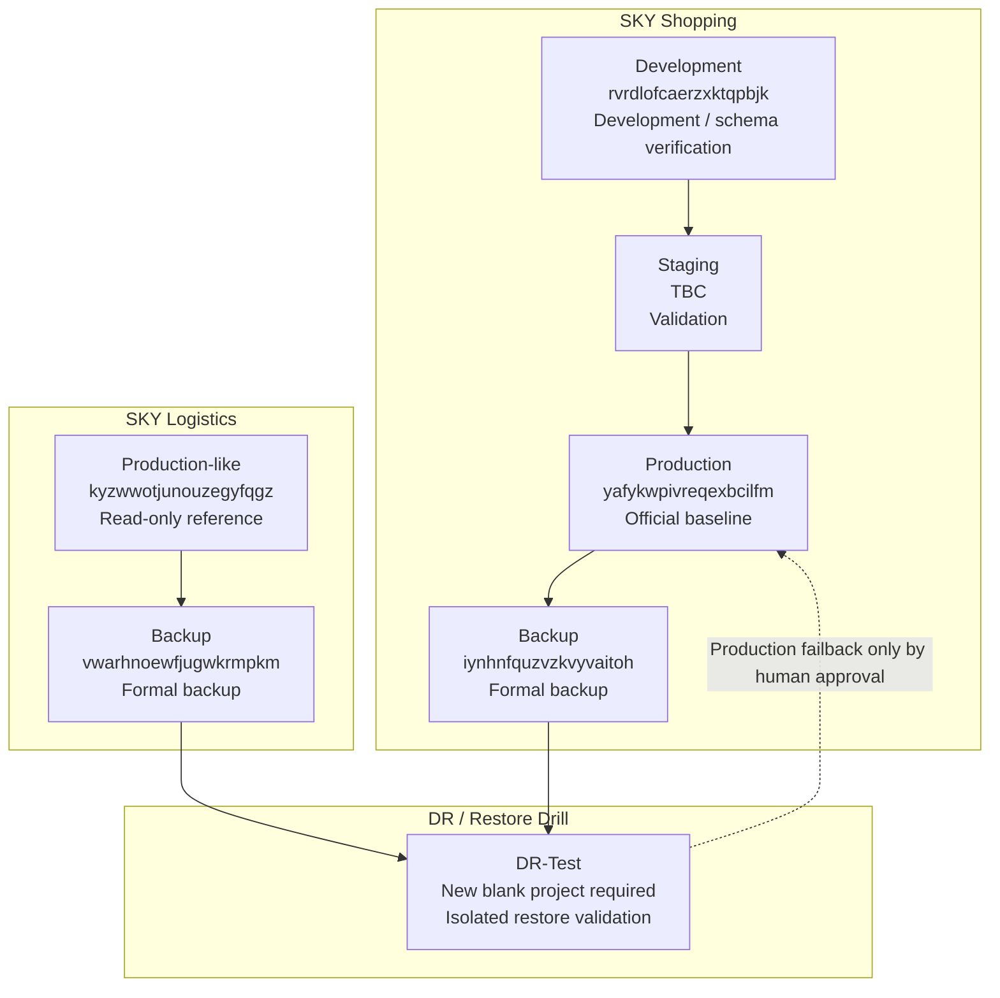

# SKY Infrastructure Master Map

Version: 1.0  
Last updated: 2026-07-02  
Authority: Primary infrastructure reference for all Agents

## Purpose

This file is the single authoritative infrastructure map for SKY Shopping, SKY Logistics, and DR / Restore Drill planning.

All Agents — Codex, Claude Code, and any future AI Agent — must use this file as the source of truth for project roles. Do not infer project roles from `MEMORY_CACHE.md`, visible Supabase organizations, old handoff notes, browser tabs, or stale branches.

## Environment Map

### 商城 / SKY Shopping

| Environment | Project Ref | Role |
| --- | --- | --- |
| Production | `yafykwpivreqexbcilfm` | Live official shopping system |
| Backup | `iynhnfquzvzkvyvaitoh` | Formal shopping backup |
| Staging | To be confirmed / created | Pre-production validation |
| Development | `rvrdlofcaerzxktqpbjk` | Development and schema verification |

### 物流 / SKY Logistics

| Environment | Project Ref | Role |
| --- | --- | --- |
| Production-like | `kyzwwotjunouzegyfqgz` | Read-only production-like logistics reference |
| Backup | `vwarhnoewfjugwkrmpkm` | Formal logistics backup |

### DR-Test / Restore Drill

| Environment | Project Ref | Role |
| --- | --- | --- |
| DR-Test | To be created | New blank isolated Restore Drill project |

DR-Test must not use any existing project that contains formal, production-like, backup, staging, development, or real customer/business data.

## Project Registry

### SKY Shopping Production

| Field | Value |
| --- | --- |
| Project Name | SKY Shopping Production |
| Project Ref | `yafykwpivreqexbcilfm` |
| Supabase URL | `https://yafykwpivreqexbcilfm.supabase.co` |
| Purpose | Official live shopping system |
| Owner | SKY Shopping / Production owner |
| DB Push | No |
| Migration | No, unless explicit production migration approval |
| Deploy | Production deploy only after approval |
| Restore | Manual approval only |
| Backup | Source only |
| Read Only | Yes, only when explicitly approved |

### SKY Shopping Backup

| Field | Value |
| --- | --- |
| Project Name | SKY Shopping Backup |
| Project Ref | `iynhnfquzvzkvyvaitoh` |
| Supabase URL | `https://iynhnfquzvzkvyvaitoh.supabase.co` |
| Purpose | Formal backup target/source |
| Owner | SKY Shopping / Backup owner |
| DB Push | No |
| Migration | No |
| Deploy | No |
| Restore | Source for DR-Test restore |
| Backup | Yes |
| Read Only | Yes |

### SKY Shopping Staging

| Field | Value |
| --- | --- |
| Project Name | SKY Shopping Staging |
| Project Ref | To be confirmed / created |
| Supabase URL | To be confirmed |
| Purpose | Pre-production validation |
| Owner | SKY Shopping / Staging owner |
| DB Push | No by default |
| Migration | Only with explicit staging approval |
| Deploy | Preview / staging only |
| Restore | No, unless staging restore test is approved |
| Backup | Optional |
| Read Only | Yes |

### SKY Shopping Development

| Field | Value |
| --- | --- |
| Project Name | SKY Shopping Development |
| Project Ref | `rvrdlofcaerzxktqpbjk` |
| Supabase URL | `https://rvrdlofcaerzxktqpbjk.supabase.co` |
| Purpose | Daily development and schema verification |
| Owner | SKY Shopping / Development owner |
| DB Push | No by default; only if explicitly approved for Dev |
| Migration | Dev only, explicit approval required |
| Deploy | No Production deploy |
| Restore | Dev-only test restore if approved |
| Backup | Optional |
| Read Only | Yes |

### SKY Logistics Production-like

| Field | Value |
| --- | --- |
| Project Name | SKY Logistics Production-like |
| Project Ref | `kyzwwotjunouzegyfqgz` |
| Supabase URL | `https://kyzwwotjunouzegyfqgz.supabase.co` |
| Purpose | Production-like logistics reference |
| Owner | SKY Logistics owner |
| DB Push | No |
| Migration | No |
| Deploy | No |
| Restore | No; not a DR-Test target |
| Backup | Source only |
| Read Only | Yes |

### SKY Logistics Backup

| Field | Value |
| --- | --- |
| Project Name | SKY Logistics Backup |
| Project Ref | `vwarhnoewfjugwkrmpkm` |
| Supabase URL | `https://vwarhnoewfjugwkrmpkm.supabase.co` |
| Purpose | Formal logistics backup |
| Owner | SKY Logistics / Backup owner |
| DB Push | No |
| Migration | No |
| Deploy | No |
| Restore | Source for logistics DR restore |
| Backup | Yes |
| Read Only | Yes |

### SKY DR-Test / Restore Drill

| Field | Value |
| --- | --- |
| Project Name | SKY DR-Test / Restore Drill |
| Project Ref | To be created |
| Supabase URL | To be created |
| Purpose | Isolated disaster recovery validation |
| Owner | SKY Infrastructure / DR owner |
| DB Push | No |
| Migration | Only as part of approved Restore Drill |
| Deploy | No Production deploy |
| Restore | Yes, target only |
| Backup | Can be snapshotted before/after drill |
| Read Only | Yes by default |

## Data Flow

### Shopping

```text
Production
↓
Backup
↓
DR-Test
```

### Logistics

```text
Production-like
↓
Backup
↓
DR-Test
```

## Deployment Flow

```text
Development
↓
Staging
↓
Production
```

Rules:

- Production is the official baseline.
- Development and Staging must remain additive relative to Production.
- No Production deploy without approval, backup, rollback plan, and Production Diff Report.

## Restore Flow

```text
Backup
↓
Restore
↓
DR-Test
↓
Production（人工批准）
```

Rules:

- Restore Drill must target the new blank DR-Test project.
- Production restore / failback requires human approval.
- Backup files and checksums must be verified before restore.
- Storage payload must be included or explicitly marked missing.

## Rules

### Production Single Source of Truth

Production is the only official product baseline. Features, routes, UI, APIs, and schema expectations must be compared against Production before any change.

### Human Execution Gate

If AI cannot complete Prisma / build / Node engine commands after one attempt, stop and ask the human to run the command locally.

Until human results are returned:

- no DB Push
- no Migration
- no Deploy
- no Git Push for code changes
- no Production modification

### No DROP

No `DROP` operation unless explicitly approved and scoped.

### No DELETE

No `DELETE` operation unless explicitly approved and scoped.

### Additive Migration

Enterprise V2 and new features must be additive by default. Destructive schema changes require explicit approval and rollback plan.

### Production Diff Report

Every implementation task must produce:

1. Production Commit
2. Working Branch Commit
3. Diff Summary
4. Additive: Yes / No
5. Production Impact: Yes / No

## Architecture Diagram



## Agent Instruction

Every Agent must read this file before acting on any Supabase, Vercel, deployment, migration, backup, restore, or environment-related task.

Do not infer project roles from `MEMORY_CACHE.md`. `MEMORY_CACHE.md` is a cache, not authority.

