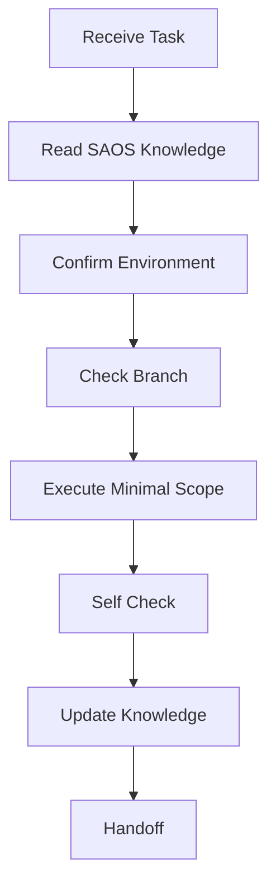

# AI Workflow

```mermaid
flowchart TD
  A["Receive Task"] --> B["Read SAOS Knowledge"]
  B --> C["Confirm Environment"]
  C --> D["Check Branch"]
  D --> E["Execute Minimal Scope"]
  E --> F["Self Check"]
  F --> G["Update Knowledge"]
  G --> H["Handoff"]
```

