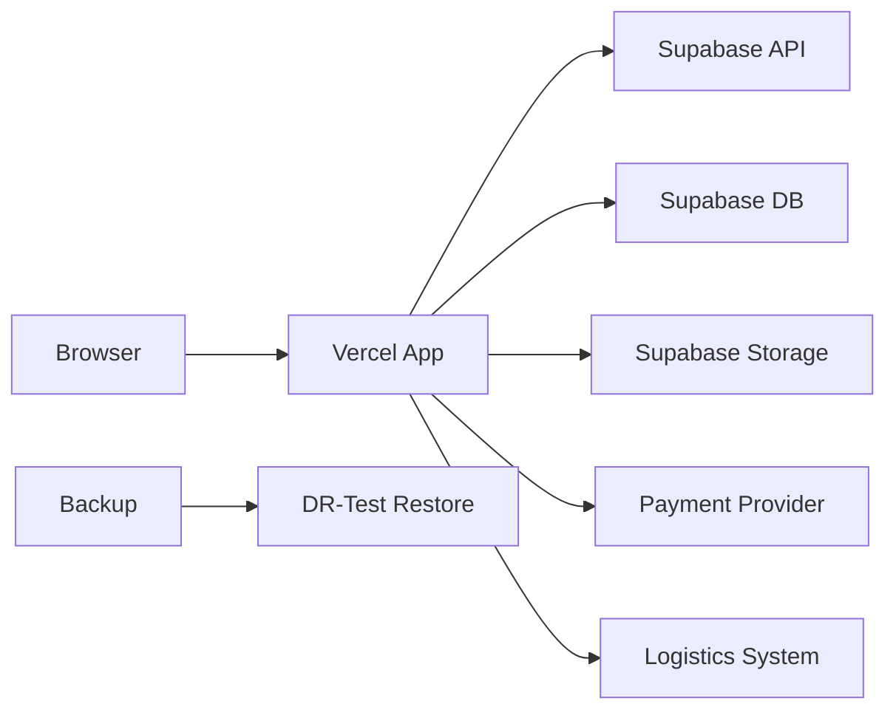

# Network Map

```mermaid
flowchart LR
  Browser["Browser"] --> Vercel["Vercel App"]
  Vercel --> SupabaseAPI["Supabase API"]
  Vercel --> SupabaseDB["Supabase DB"]
  Vercel --> Storage["Supabase Storage"]
  Vercel --> Payment["Payment Provider"]
  Vercel --> Logistics["Logistics System"]
  Backup["Backup"] --> DRTest["DR-Test Restore"]
```

