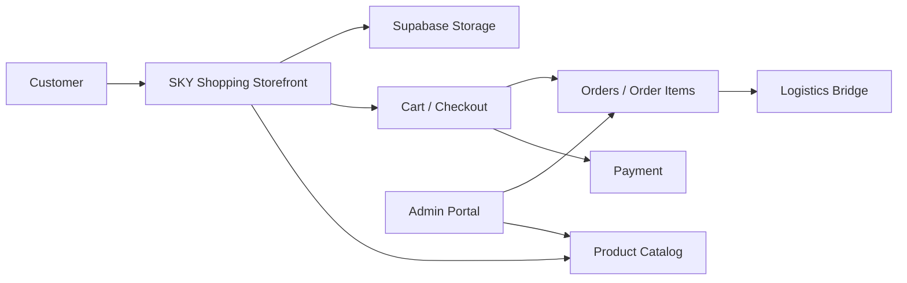

# System Flow

```mermaid
flowchart LR
  User["Customer"] --> Storefront["SKY Shopping Storefront"]
  Storefront --> Catalog["Product Catalog"]
  Storefront --> Cart["Cart / Checkout"]
  Cart --> Payment["Payment"]
  Cart --> Orders["Orders / Order Items"]
  Orders --> Logistics["Logistics Bridge"]
  Storefront --> Storage["Supabase Storage"]
  Admin["Admin Portal"] --> Catalog
  Admin --> Orders
```

